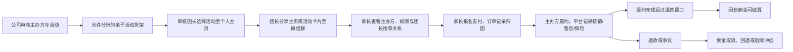
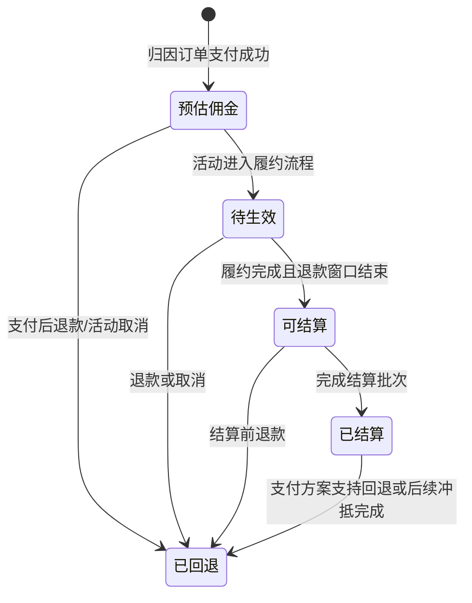

# 亲子活动平台增长阶段产品路线图

版本：V1.0  
日期：2026-05-26  
依据：[和趣活动数据与公开市场信号分析报告](./和趣活动数据与公开市场信号分析报告.md)  
目标：在保留亲子活动交易合规底座的基础上，验证私域团长帮卖是否能够带来质量可控的增量订单。

## 1. 路线图结论

产品下一阶段不是泛社群商城，也不是立即把所有团长需求加入工作台，而是从已验证的亲子活动成交能力向**受控分销平台**升级：

> 公司精选亲子活动并承接家长交易与售后；主办方负责现场履约；通过审核的团长以个人轻主页和专属分享推荐活动，获得仅一级、履约后生效的帮卖佣金。

### 当前优先顺序

| 优先级 | 建设项 | 决策 |
| --- | --- | --- |
| P0 | 订单归因、渠道标识、退款与成本口径 | 不具备则无法验证增长 |
| P0 | 团长轻主页 | 做身份承接、活动货架、责任披露和分享归因 |
| P0 | 一级帮卖佣金账本 | 做预估、待生效、可结算、已结算、回退 |
| P0 | 精选外部活动准入与质量治理 | 公司审核后上架，不开放自助供给市场 |
| P1 | 团长数据页与活动选择效率 | 在归因有效后增强 |
| Later | 成人体验/本地服务 | 另行验证 |
| 不纳入本轮 | 商品、多级分销、内容社区、优惠券裂变 | 不与亲子帮卖同时铺开 |

## 2. 角色模型与商业闭环

### 2.1 角色重新定义

| 角色 | 定义 | 对家长承担的内容 | 不承担 |
| --- | --- | --- | --- |
| 公司/平台 | 精选采购或代售活动，提供小程序交易和售后承接 | 交易入口、订单留痕、售后入口、违规治理、平台规则 | 自动担保活动效果或人身安全 |
| 主办方 | 实际提供活动与现场服务的一方 | 活动内容真实性、现场履约、安全安排、异常配合 | 团长渠道运营 |
| 团长 | 经审核的亲子社群群主/一级推荐者 | 显示推荐身份，分享公司允许推广的活动 | 现场履约、代替平台处理退款、发展二级分销 |
| 家长/监护人 | 为儿童与陪同人员报名付款者 | 提供必要信息、确认规则与保险授权 | - |

### 2.2 商业闭环

### 2.3 收益和责任原则

- 公司收益模型需以活动售价、采购/主办方结算价、支付成本、团长佣金和售后成本计算贡献毛利。
- 团长仅获得直接归因订单的一层佣金，佣金不得因发展下级团长产生。
- 家长端始终同时展示实际主办方和推荐团长，避免推荐者被误认为履约服务方。
- 儿童信息、监护授权、保险和售后订单记录沿用已验证交易底座，不因分销而放宽。

## 3. Epic A：轻量团长主页 MVP

### 3.1 产品假设

我们相信，为亲子微信群团长提供一个展示身份、推荐活动和交易信任说明的页面，会让家长更容易发现可报名活动并理解推荐与履约关系，同时为平台建立可靠归因入口。

### 3.2 页面范围

| 模块 | 首期内容 | 规则 |
| --- | --- | --- |
| 身份区 | 头像、团长名称、社群名称/类型、简短推荐说明、平台审核状态 | 不展示未经审核的资质或夸张承诺 |
| 关系披露 | `本页活动由团长推荐，实际服务由活动主办方提供；订单支付与售后请在平台完成` | 首屏可见 |
| 推荐货架 | 公司审核并允许推广的亲子活动列表 | 团长只能上下架授权活动 |
| 活动卡片 | 标题、适龄、最近场次、价格、主办方、保险提示、退款摘要 | 点击进入正式详情和规则 |
| 信任入口 | 平台交易说明、退款/申诉入口说明、儿童信息及保险说明 | 固定展示 |
| 分享归因 | 分享主页或单活动卡片，携带团长和入口参数 | 不依赖手填归因 |

### 3.3 明确不做

- 社群帖子、评论、打卡和群成员互动。
- 团长自建商品货架、优惠券、内容资料库。
- 团长招募、等级裂变或公开排行榜。

### 3.4 最小数据

| 对象 | 字段 |
| --- | --- |
| 团长主页 | `leader_id`、展示名、审核状态、社群类型/规模档位、披露文案版本、状态 |
| 主页活动关联 | `leader_id`、`activity_id`、允许推广状态、上架时间、下架原因 |
| 访问事件 | `leader_id`、活动 ID（若有）、入口类型、访问/点击/支付事件、匿名访问标识 |

## 4. Epic B：一级帮卖分销 MVP

### 4.1 分销规则

| 能力 | MVP 规则 |
| --- | --- |
| 可推广供给 | 仅公司已审核且标记为允许分销的亲子活动 |
| 团长资格 | 运营审核通过后开放主页与分享能力 |
| 归因 | 首轮采用订单锁定唯一直接团长；归因有效期与冲突优先级由上线前规则确认 |
| 佣金 | 活动级配置固定比例或固定金额；订单生成佣金明细 |
| 生效 | 支付后显示预估，完成履约且超过该活动公开退款窗口后可结算 |
| 退款 | 可结算前退款取消佣金；结算后发生退款进入回退/冲抵流程 |
| 家长展示 | 显示团长为推荐来源、主办方为履约方、平台为订单售后入口 |

### 4.2 佣金状态机

### 4.3 支付前置约束

- 微信支付平台收付通公开支持平台交易抽佣以及向分销达人等参与方分账，但真实角色、进件和结算路径需以服务商审核为准。
- 微信支付“请求分账回退”文档说明：对已分账资金退款时可先回退商户类型接收方资金，但不支持对“分账给个人”的分账单发起该回退。
- 因团长可能是个人，MVP 默认采用**履约完成且退款窗口结束后才可结算**；“已结算后退款”的资金路径须由支付/法务给出可执行方案后才上线。

### 4.4 数据对象

| 对象 | 关键字段 |
| --- | --- |
| 推广归因 | `order_id`、`leader_id`、入口来源、分享参数、归因确认时间 |
| 佣金规则 | `activity_id`、佣金方式、金额/比例、生效起止、退款窗口、规则版本 |
| 佣金明细 | 订单、团长、预估金额、状态、生效时间、结算批次、回退金额与原因 |
| 团长数据 | 页面访问、活动点击、支付订单、核销、退款、可结算佣金、已结算、回退 |

## 5. Epic C：精选外部亲子活动供给

### 5.1 供给模式

公司先采用**精选采购/代售**，不建立开放供应商市场。运营选择外部活动，完成资料审核和交易责任确认后，再决定是否允许团长帮卖。

### 5.2 准入清单

| 准入对象 | 必须提供/确认 |
| --- | --- |
| 主办方 | 主体与联系人、收结算资料、活动履约责任确认、安全材料、异常协助机制 |
| 活动 | 适龄范围、时间地点、名额、陪同、服务内容、安全须知、退款、保险适用、禁入审查 |
| 平台展示 | 主办方身份、公司售后入口、团长推荐关系、规则版本 |
| 质量治理 | 支付、核销、取消、退款、投诉、保险异常、停止分销状态 |

### 5.3 选品策略

| 活动类型 | 策略 |
| --- | --- |
| 已有成交且低退款的室内体验/标准化票务 | 优先纳入试点 |
| 高退款或责任边界未明的户外、研学、采摘、复杂行程 | 先限制或排除 |
| 高安全风险、托管培训、医疗健康、跨城住宿等 | 维持禁入，另行立项评审 |

## 6. Epic D：数据与运营底座

### 6.1 上线前字段

| 对象 | 必增字段 |
| --- | --- |
| 活动 | 主办方 ID、供给类型、正式品类、允许分销、售价、采购/结算成本、毛利预算、退款窗口 |
| 团长 | 团长 ID、社群类型/规模档位、审核状态、主页状态、有效分享与有效推广订单 |
| 订单 | 主办方 ID、推广团长 ID、入口、支付金额、退款原因、保险状态、佣金金额/状态 |
| 佣金 | 规则版本、预估、可结算、结算批次、回退金额和原因 |
| 售后 | 退款原因、投诉类型、责任方、处理时效、关闭结果 |

### 6.2 指标框架

| 目标 | 核心指标 | 护栏 |
| --- | --- | --- |
| 归因有效 | 帮卖订单可归因比例、主页至支付漏斗 | 归因缺失/冲突率 |
| 增量成交 | 帮卖新客订单、渠道支付 GMV、每团长贡献 | 自有渠道订单被简单迁移 |
| 交易质量 | 核销完成率、退款率、投诉率、复购率 | 保险异常、重大安全事故 |
| 经济成立 | 贡献毛利、佣金成本率、售后成本率 | 退款后佣金无法追回 |
| 供给治理 | 主办方质量分层、活动关闭分销数量 | 高风险活动扩散 |

### 6.3 必做口径治理

- 先确认现有 `实际收入_元` 和 `累计退款金额_元` 定义，再将其接入经营看板。
- 由运营人工校准历史活动品类，形成稳定枚举和分销白名单。
- 在上线前形成订单、渠道、供给、佣金和售后周报；不以浏览量或分享量代替支付质量。

## 7. Now / Next / Later

### Now：增长基础与受控试点

**目标：** 证明团长帮卖可被正确记录、正确结算，并观察是否出现质量可控的增量成交。

| 建设项 | 交付 | 验收门槛 |
| --- | --- | --- |
| 数据治理 | 收入/退款口径、供给品类校准、归因字段和周报 | 关键字段定义完成并能导出 |
| 团长轻主页 | 身份、披露、活动货架、分享归因 | 家长可识别主办方/团长/售后关系 |
| 一级帮卖 | 选择活动、专属分享、推广订单、佣金状态 | 订单/退款/佣金链路可回溯 |
| 精选外部供给 | 准入、审核、允许分销、停止分销 | 高风险供给可阻断 |
| 支付方案 | 延迟结算和退款后处理确认 | 服务商/法务通过再开放真实佣金结算 |

**试点规模与指标：**

| 指标 | 门槛 |
| --- | ---: |
| 审核参与的帮卖团长 | 至少 10 名 |
| 可分销亲子活动 | 至少 20 场 |
| 帮卖订单、退款、佣金、回退状态完整率 | 100% |
| 帮卖成交可追踪至主页或专属分享入口 | 至少 80% |
| 多级分销、错误履约责任展示、结算方案违规 | 0 |

### Next：验证规模化价值

**进入条件：** Now 数据完整、资金路径通过、没有重大安全/隐私/结算问题。

| 建设项 | 判断问题 |
| --- | --- |
| 团长经营数据与结算记录 | 团长是否持续推广并认可履约后结算 |
| 主办方质量档案和活动分销分层 | 是否可扩外部供给而不恶化售后 |
| 自有 vs 帮卖渠道对比 | 是否带来新增订单和正贡献毛利 |
| 家长复购与收藏/回访能力（轻量） | 主页是否形成可复用入口 |

**进入扩量门槛：**

- 帮卖渠道有可识别的新增订单，不只是已有订单换入口。
- 帮卖订单退款/投诉不显著差于自有渠道。
- 扣除主办方成本、支付成本、佣金及售后成本后为正贡献毛利。
- 团长存在持续分享和重复成交行为。

### Later：横向品类独立决策

| 方向 | 前置条件 |
| --- | --- |
| 成人体验或低风险本地服务 | 单独评估供给、责任、保险/退款规则与团长受众匹配 |
| 商品团购 | 单独立项，补齐库存、物流、供货、退换、商品质量和售后责任 |
| 内容社区/互动 | 先证明主页回访需求和运营承接能力 |
| 更多分销玩法 | 不引入多级分销或招募返佣；任何扩展需重新完成合规评审 |

## 8. 停止与转向规则

| 触发条件 | 动作 |
| --- | --- |
| 归因、退款和佣金状态无法完整记录 | 暂停帮卖扩量，只保留自营活动 |
| 支付服务商或法务否决计划结算/回退路径 | 不上线真实佣金自动结算，重新设计合作方式 |
| 团长渠道退款/投诉明显变差 | 关闭对应活动/团长推广资格，复盘供给与披露 |
| 团长只需要转发单链接，不使用主页且无转化收益 | 缩减主页投入，保留最小归因工具 |
| 需求主要转向商品或非亲子服务 | 形成新的立项材料，不膨胀当前 MVP |

## 9. 关键验收场景

- 公司上架一场自营活动和一场外部精选活动，均展示实际主办方、安全、保险和退改规则。
- 审核团长创建主页，选择允许推广的活动并将主页或单活动分享至微信群。
- 家长从团长入口支付，订单记录主办方、团长、入口、规则快照、监护授权及保险信息。
- 活动完成且退款窗口结束后，佣金从待生效进入可结算。
- 支付后退款、活动取消与结算后退款分别形成佣金取消或回退/冲抵记录。
- 运营能以团长、活动、主办方和渠道查看支付、核销、退款、佣金和贡献毛利。
- 用户无法创建二级分销关系，无法推广商品或未开放服务。

## 10. 公开依据

- [和趣活动数据与公开市场信号分析报告](./和趣活动数据与公开市场信号分析报告.md)
- [群接龙帮卖说明](https://help.qunjielong.com/9a11/2346/)
- [小鹅通内容分销](https://www.xiaoe-tech.com/distribution)
- [有赞分销平台与群团购方案](https://fx.youzan.com/)
- [微信支付平台收付通](https://pay.wechatpay.cn/doc/v3/partner/4012086891)
- [微信支付请求分账回退](https://pay.wechatpay.cn/doc/v3/merchant/4012525287)
- [《儿童个人信息网络保护规定》](https://www.gov.cn/zhengce/2019-10/08/content_5728947.htm)
- [《未成年人网络保护条例》](https://www.gov.cn/zhengce/content/202310/content_6911288.htm)
- [《互联网广告管理办法》](https://www.gov.cn/zhengce/202305/content_6858084.htm)

