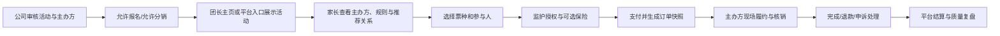

# 亲子活动交易与受控分销平台产品规划

版本：V3.0 增长阶段修订版  
日期：2026-05-26  
用途：产品定位、研发范围、运营责任与增长验证对齐  
前序依据：[私域社群变现公开网络调研报告](./私域社群变现公开网络调研报告.md)、[亲子活动小程序页面评审与改版规格](./亲子活动小程序页面评审与改版规格.md)  
新增依据：[和趣活动数据与公开市场信号分析报告](./和趣活动数据与公开市场信号分析报告.md)、[亲子活动平台增长阶段产品路线图](./亲子活动平台增长阶段产品路线图.md)

## 1. 当前结论

### 1.1 产品定位

产品已完成亲子活动交易场景验证，当前升级定位为：

> 面向家长、亲子活动主办方与拥有亲子微信群的团长，提供微信小程序内的精选亲子活动展示、家长报名支付、儿童与保险必要记录、现场核销、退款售后留痕，以及受控一级帮卖归因和结算服务。

### 1.2 阶段变化

V2.0 版本用于完成亲子活动交易闭环，曾将 `团长` 定义为活动组织者并暂不建设分销。根据现阶段真实业务，必须拆分为两种身份：

| 角色 | 当前定义 |
| --- | --- |
| 主办方 | 实际提供活动与现场履约的一方；可能为公司自营团队，也可能为公司精选合作方 |
| 团长 | 拥有亲子微信群、经审核后推荐活动的一级帮卖者；不是现场履约方 |

交易、儿童授权、保险、核销与售后留痕仍是基础能力；新增投入只围绕亲子活动的主页承接、归因、佣金和外部供给审核展开。

### 1.3 本阶段产品判断

| 方向 | 决策 | 理由 |
| --- | --- | --- |
| 轻量团长主页 | 建设 | 集中承接推荐、责任展示和归因 |
| 一级帮卖 | 受控建设 | 已有实际帮卖行为，但必须先形成数据和退款后佣金规则 |
| 外部亲子活动 | 精选代售 | 扩供给但不开放无审核市场 |
| 亲子订单、保险与售后 | 保留并强化 | 分销不能削弱家长信任与儿童保护 |
| 商品与泛服务 | 暂不开放 | 需独立验证和责任设计 |
| 多级分销/裂变招募 | 不做 | 不属于当前增量验证必要条件 |

## 2. 数据依据与核心风险

源表 [和趣活动记录.xlsx](C:/Users/14575/Downloads/和趣活动记录.xlsx) 提供的经营基线：

| 指标 | 基线 |
| --- | ---: |
| 活动数 | 227 |
| 订单数 | 6,207 |
| 退款订单数 | 1,754 |
| 退款订单比例 | 约 28.3% |
| `实际收入_元` 合计 | 139,778.33 元 |
| 累计退款金额 | 77,579.90 元 |

当前不能直接宣称帮卖有效或利润成立：

- 表内没有团长来源、分享访问、佣金、采购/结算成本或复购数据。
- 有 `42` 场活动的累计退款金额高于实际收入字段，必须先确认数据口径。
- 名称启发式初筛显示户外/研学/采摘类退款订单比例较高，首轮不应优先扩量。

## 3. 用户、角色与责任

### 3.1 核心角色

| 角色 | 主要任务 | 对家长展示 | 关键责任 |
| --- | --- | --- | --- |
| 家长/监护人 | 浏览活动、为儿童报名、确认规则和保险、支付、申请售后 | 本人订单、主办方、推荐团长、规则快照 | 提供必要报名与授权信息 |
| 儿童参与者 | 参加亲子活动 | 不公开展示 | 仅处理必要履约/投保信息 |
| 主办方 | 提供场次、服务和现场履约 | 活动详情与订单中明确展示 | 内容真实性、安全、核销配合、异常处理 |
| 团长 | 选择获准活动、分享主页/活动、查看推广结果 | 作为推荐来源展示 | 合规推荐，不作虚假承诺，不承担履约 |
| 公司/平台 | 精选供给、交易售后、审核治理、归因佣金 | 平台交易/售后规则 | 规则留痕、投诉处理、支付/结算合规 |

### 3.2 责任披露固定文案

团长主页与团长来源订单的付款前页面应固定呈现：

> 本页面活动由团长推荐。具体活动由页面所示主办方提供，订单支付、退款申请和售后记录由和趣平台承接。请在付款前查看适龄、安全、保险和退改规则。

团长进行带购买入口的公开推广内容时，应按适用法规及平台规则显著披露推广关系。

## 4. 供给与范围边界

### 4.1 首轮可供给活动

- 公司自营且已有交付记录的亲子活动。
- 公司精选采购/代售的外部亲子活动，经资料和规则审核后方可上架。
- 优先选择交付边界清晰、场次稳定、退款风险可控的标准化活动或低风险室内体验。

### 4.2 外部主办方准入

| 模块 | 要求 |
| --- | --- |
| 主体资料 | 主体/负责人信息、联系电话、结算材料 |
| 履约材料 | 场地、活动描述、人员安排、安全措施、异常联系方式 |
| 活动字段 | 适龄、陪同、场次名额、票种、退改、保险适用及安全须知 |
| 质量指标 | 取消、退款、核销、投诉、保险异常、是否允许分销 |
| 处理方式 | 公司决定上架、暂停分销或下架；不开放自助供应商市场 |

### 4.3 仍禁止或后置

| 类型/能力 | 处置 |
| --- | --- |
| 医疗健康、功效保证、学科/结果承诺、托管、住宿营地、高风险活动 | 禁入或专项评审后再决策 |
| 商品团购、生鲜、实物分销 | 不开放，未来独立立项 |
| 成人体验、本地生活服务 | Later 独立验证 |
| 多级分销、招募返佣、公开裂变排名 | 不做 |
| 内容帖子、群成员社区、资料库 | 不进入轻主页 MVP |

## 5. 基础交易闭环

## 6. 交易基础能力

### 6.1 家长端

| 模块 | 必须能力 |
| --- | --- |
| 活动详情 | 主办方、推荐团长（若有）、适龄、陪同、场次、票种、安全、退款、保险说明 |
| 报名支付 | 儿童/成人陪同票、必要参与人信息、监护授权、逐人可选保险、微信支付 |
| 订单详情 | 规则快照、授权记录、投保状态、核销凭证、退款/申诉、通知群入口 |
| 团长主页 | 团长身份、推荐关系、获准活动货架、平台交易和售后说明 |

### 6.2 主办方/履约管理

| 模块 | 必须能力 |
| --- | --- |
| 活动资料 | 场次、票种、安全与退款规则、保险配置、审核状态 |
| 履约 | 报名名单、核销、活动变更/取消、完成确认 |
| 售后配合 | 退款原因、异常说明、必要证据与处理反馈 |
| 质量状态 | 允许分销、限制分销、已下架及原因 |

### 6.3 团长端

| 模块 | MVP 能力 |
| --- | --- |
| 入驻审核 | 团长身份、展示名、社群类型/规模档位、结算所需信息、推广承诺 |
| 我的主页 | 身份区、推荐披露、活动货架、分享 |
| 可推广活动 | 浏览允许分销活动、上架/下架至主页 |
| 推广订单 | 归因订单、支付/核销/退款状态、实际主办方 |
| 佣金明细 | 预估、待生效、可结算、已结算、已回退 |

### 6.4 平台运营端

| 模块 | MVP 能力 |
| --- | --- |
| 主办方/活动审核 | 准入资料、风险品类、规则字段、是否允许分销 |
| 团长审核 | 资格、状态、违规处理、主页启停 |
| 售后工单 | 订单快照、监护授权、保险、核销、退款、投诉证据 |
| 佣金与支付查询 | 归因、佣金规则、结算、退款/回退或冲抵结果 |
| 数据分析 | 自有/团长渠道、主办方质量、活动退款与贡献毛利 |

## 7. 儿童、保险与售后合规底座

### 7.1 儿童信息与监护授权

- 对儿童姓名、年龄/出生必要信息、监护关系、紧急联系和投保必要字段实行最小必要收集。
- 在支付前显著展示处理目的、字段范围、规则版本与家长授权动作。
- 每笔涉及儿童的订单保存授权、安全须知和退款规则快照。
- 儿童及保险信息不得用于团长营销画像、公开主页展示或裂变传播。

### 7.2 保险

- 保险按实际参与人可选配置，展示产品摘要、承保方、费用、适用条件和理赔/查询说明。
- 系统记录 `未选择`、`待投保`、`投保成功`、`投保失败需处理`、`已退保/失效`。
- 活动取消、退款与保险退保/退款必须在订单中形成关联处理记录。

### 7.3 售后

- 报名后的通知群仅用于活动通知，不替代平台订单的退款或申诉入口。
- 活动取消、场次变更和服务争议均应引用报名时规则快照处理。
- 平台承接售后入口和协助流程，不对体验结果或人身安全作自动担保。

## 8. 团长主页与一级帮卖规则

### 8.1 轻主页

| 页面模块 | 内容 |
| --- | --- |
| 团长身份 | 展示名、头像、社群说明、平台审核标识 |
| 推荐披露 | 团长为推荐者、主办方为履约者、平台承接交易售后 |
| 活动货架 | 仅展示平台授权团长推广的在售亲子活动 |
| 卡片摘要 | 适龄、场次、价格、主办方、保险和退款摘要 |
| 信任入口 | 售后说明、儿童信息与保险说明 |
| 分享归因 | 主页/活动分享携带唯一团长参数 |

### 8.2 一级佣金

| 规则 | 处理 |
| --- | --- |
| 归因 | 家长经团长主页或专属活动卡片下单，订单锁定唯一直接团长 |
| 层级 | 仅一级推荐，不存在下级分成 |
| 状态 | `预估佣金`、`待生效`、`可结算`、`已结算`、`已回退` |
| 生效 | 活动履约完成且超过公示退款窗口后进入可结算 |
| 退款 | 未结算取消佣金；已结算按核准支付方案回退或冲抵 |
| 展示 | 家长端不展示佣金金额，但必须展示推荐关系；团长端展示明细 |

### 8.3 结算前置条件

微信支付公开文档显示平台型业务可在满足条件后处理佣金/分账，但分账回退对接收方类型存在限制。真实佣金结算上线前必须完成：

- 团长收佣主体类型确认及支付服务商方案审核。
- 履约完成、退款窗口、退款后回退/冲抵规则协议化。
- 结算账单、异常处理与对账能力验收。
- 不采用平台私下代收、资金池或无法审计的人工打款方式替代正式方案。

## 9. 核心数据对象

| 对象 | 最小字段 |
| --- | --- |
| 主办方 | ID、类型、公开名称、联系人、审核与质量状态、结算资料 |
| 团长 | ID、展示资料、社群档位、审核状态、主页状态、推广承诺、结算主体类型 |
| 活动 | 主办方 ID、供给类型、分类、适龄、安全、退款、保险、分销状态、退款窗口、售价和成本预算 |
| 场次/票种 | 时间、报名截止、库存；儿童票/成人陪同票、实际参与与保险适用 |
| 订单 | 活动/规则快照、主办方、团长归因、入口、付款、退款、核销、完成、保险与授权 |
| 佣金 | 规则版本、金额、状态、生效时间、结算批次、回退/冲抵结果 |
| 渠道漏斗 | 主页访问、活动点击、下单、支付、核销、退款、复购 |

## 10. 路线图与门槛

### Now：受控帮卖试点

- 确认收入、退款、成本和佣金字段口径。
- 上线团长轻主页、专属分享归因、推广订单和佣金状态。
- 上线主办方/外部活动准入、允许分销与暂停分销规则。
- 延续亲子订单、授权、保险、核销和售后能力。
- 仅开放亲子活动，不开放商品或泛服务。

| 指标 | 门槛 |
| --- | ---: |
| 审核帮卖团长 | 至少 10 名 |
| 可分销亲子活动 | 至少 20 场 |
| 帮卖订单归因、退款和佣金记录完整率 | 100% |
| 帮卖成交可追踪至主页或分享入口 | 至少 80% |
| 多级分销、错误责任展示、严重结算/隐私/安全事故 | 0 |

### Next：扩量判断

- 对比自有渠道与帮卖渠道的支付、核销、退款、投诉、复购与贡献毛利。
- 为团长提供经营数据和结算历史；为主办方建立质量档案。
- 只有在增量、质量和正贡献毛利均成立后，扩大外部亲子供给。

### Later：独立扩品类

- 成人体验、本地服务或商品均需单独形成供给、售后和合规评审。
- 商品团购不因活动分销跑通而自动恢复入口。

## 11. 验收场景

- 公司为自营和外部精选亲子活动分别配置真实主办方、规则、保险与允许分销状态。
- 团长通过审核后建立主页，选择允许推广的活动并分享至微信群。
- 家长付款前看到团长推荐关系、实际主办方、平台售后以及儿童/保险规则。
- 家长订单记录唯一团长归因，同时保留参与人、授权、保险、核销与退款留痕。
- 履约完成且过退款窗口后佣金才进入可结算；退款能取消或按核准方案回退/冲抵佣金。
- 运营可以关闭高退款活动分销，并查看主办方、活动和团长渠道质量。
- 平台不出现商品货架、多级分销、团长招募返佣或内容社区入口。

## 12. 公开依据

- [群接龙帮卖说明](https://help.qunjielong.com/9a11/2346/)
- [小鹅通内容分销](https://www.xiaoe-tech.com/distribution)
- [有赞分销平台与群团购方案](https://fx.youzan.com/)
- [麦淘亲子](https://www.maitao.com/)
- [微信支付平台收付通](https://pay.wechatpay.cn/doc/v3/partner/4012086891)
- [微信支付请求分账回退](https://pay.wechatpay.cn/doc/v3/merchant/4012525287)
- [《儿童个人信息网络保护规定》](https://www.gov.cn/zhengce/2019-10/08/content_5728947.htm)
- [《未成年人网络保护条例》](https://www.gov.cn/zhengce/content/202310/content_6911288.htm)
- [《互联网广告管理办法》](https://www.gov.cn/zhengce/202305/content_6858084.htm)

